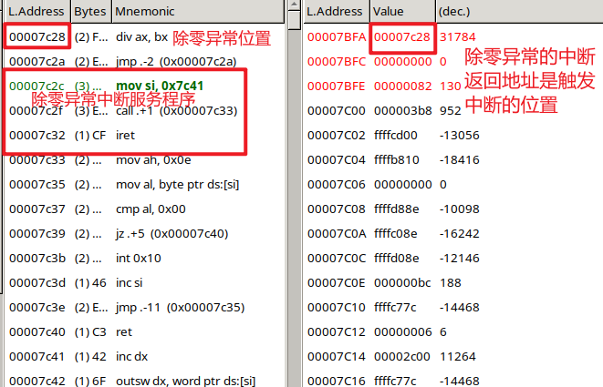

# 中断函数

## 中断
- 内中断
    - 软中断
        - 系统调用：读写程序、
    - 异常
        - 除零异常
        - 指令错误 指令无法解析
        - 缺页错误
- 外中断
    - 时钟中断
    - 键盘中断
    - 硬盘中断
        - 同步io
        - 异步io
        - DMA Direct Memory Access


## 中断函数

* 函数 call / ret
    - eip
* 中断 int / iret
    - eip
    - cs
    - eflags

## 中断向量表

实模式内存布局中：`0x000` - `0x3ff`

4B 表示一个中断向量，共 256 个中断向量（中断函数

地址线16位

段地址（cs） << 4 + 偏移地址（ip）

## 内存分段

16bit 有 64K 地址空间，需要分段机制来实现访问 1M 内存

32bit 访问所有 4G 内存

为了兼容8086，分段的概念被延续

## 代码

中断注册与触发

```s
; 注册中断函数
mov word [0x80 * 4], interrupt ; 偏移量
mov word [0x80 * 4 + 2], 0 ; 段地址

; 0x80 即中断向量表的索引
int 0x80 ; 0x80 是系统调用的中断向量

; 阻塞
jmp $

interrupt:
    mov si, booting_string
    call print
    iret
```

软中断

```s
; 注册中断函数
mov word [0x0 * 4], interrupt ; 偏移量
mov word [0x0 * 4 + 2], 0 ; 段地址

; 0x80 即中断向量表的索引
mov dx, 0
mov ax, 1
mov bx, 0

xchg bx, bx
div bx  ; dx:ax / bx

; 阻塞
jmp $

interrupt:
    mov si, booting_string
    call print
    iret
```

异常的中断返回地址




中断和普通函数调用相比，除了保存返回地址 eip，还保存 cs eflags 寄存器